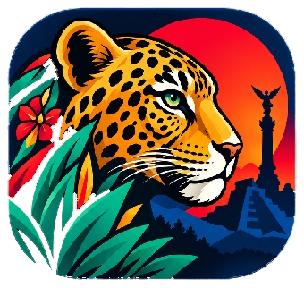

<p align="center">
  
</p>

<h1 align="center">MXGuide</h1>

<p align="center"><strong>México en tus manos</strong></p>

<p align="center">
  
  
  
</p>

---

## 📖 Acerca del proyecto

**MXGuide** es una aplicación móvil pensada para turistas que quieren conocer México. Reúne los lugares turísticos del país en un solo lugar para que cualquier viajero pueda descubrirlos, planear su visita y llevar un registro de su recorrido, todo desde la palma de su mano.

Además de explorar destinos, la app acompaña al usuario durante su viaje: le avisa cuando está cerca de una atracción, le muestra dónde hospedarse y comer, y le permite compartir su experiencia con otros viajeros.

## ✨ Funcionalidades

- **Explorar lugares turísticos** de todo México, con búsqueda y filtros por categoría (históricos, naturales, playas, pueblos mágicos) y por estado.
- **Checklist de lugares visitados**, donde el usuario marca cada destino que ya conoció y lleva el registro de su recorrido.
- **Fotos y reseñas**, para que cada usuario suba sus fotos y comparta su opinión sobre los lugares que visitó.
- **Hoteles y restaurantes cercanos** a cada atracción, para facilitar la planeación del viaje.
- **Notificaciones por cercanía**: usando la ubicación del usuario, la app le avisa cuando está cerca de una atracción y lo invita a visitarla.
- **Favoritos** para guardar los lugares que el usuario quiere conocer.
- **Inicio de sesión** con correo y contraseña o con Google, además de un **modo invitado** para explorar sin cuenta.
- **Modo claro y oscuro** automático según la configuración del celular, con opción de cambiarlo manualmente.

## 🚧 Estado del proyecto

| Módulo | Estado |
| --- | --- |
| Splash screen | ✅ Listo |
| Login (correo, Google e invitado) | ✅ Interfaz lista · 🔌 pendiente de conectar al backend |
| Home con barra de navegación | ✅ Listo |
| Explorar (búsqueda y filtros) | ✅ Interfaz lista · 🔌 pendiente de conectar a la API |
| Tema claro / oscuro | ✅ Listo |
| Detalle del lugar | 🚧 En desarrollo |
| Mapa | 🚧 En desarrollo |
| Logros / checklist de visitados | 🚧 En desarrollo |
| Perfil | 🚧 En desarrollo |
| Fotos y reseñas | 🚧 En desarrollo |
| Hoteles y restaurantes cercanos | 🚧 En desarrollo |
| Notificaciones por cercanía | 🚧 En desarrollo |

## 🛠️ Tecnologías

### Frontend

| Tecnología | Uso |
| --- | --- |
| [Flutter](https://flutter.dev/) | Framework para el desarrollo de la app móvil (Android e iOS) |
| [Dart](https://dart.dev/) | Lenguaje de programación |
| Material 3 | Sistema de diseño base de los componentes |
| [google_fonts](https://pub.dev/packages/google_fonts) | Tipografías Montserrat y Nunito |
| [Figma](https://www.figma.com/) | Diseño de interfaces y prototipos |

### Backend

> 🔧 Sección pendiente: la completará el equipo de backend.

| Tecnología | Uso |
| --- | --- |
| — | — |

## 🎨 Diseño

### Paleta de colores

| Color | Modo claro | Modo oscuro | Uso |
| --- | --- | --- | --- |
| Sun Red | `#D32F2F` | `#E57373` | Acentos, favoritos |
| Jungle Teal | `#00796B` | `#4DB6AC` | Color principal: botones y elementos activos |
| Jaguar Ochre | `#D87B1E` | `#FFB74D` | Botón central y destacados |
| Fondo | `#F5F5F0` | `#121212` | Fondo de pantallas |
| Texto principal | `#0A1A2F` | `#FFFFFF` | Títulos y textos |
| Texto secundario | `#607D8B` | `#B0BEC5` | Descripciones y etiquetas |

### Tipografía

- **Montserrat** para títulos.
- **Nunito** para el resto de los textos.

Las fuentes se definen en un solo lugar (`AppFonts` en `lib/theme/app_theme.dart`), así que cambiarlas afecta a toda la app.

## 📁 Estructura del proyecto

```
lib/
├── main.dart                 # Punto de entrada, rutas y tema
├── data/
│   └── mock_places.dart      # Datos de prueba (temporales hasta conectar la API)
├── models/
│   └── place.dart            # Modelo de lugar turístico
├── screens/
│   ├── splash_screen.dart
│   ├── login_screen.dart
│   ├── home_screen.dart      # Barra de navegación inferior
│   └── explore_screen.dart   # Búsqueda y filtros de lugares
├── theme/
│   ├── app_colors.dart       # Paleta de colores
│   ├── app_theme.dart        # Temas claro/oscuro y tipografía
│   └── theme_controller.dart # Cambio manual de tema
└── widgets/
    └── place_card.dart       # Tarjeta de lugar
```

## 🚀 Cómo ejecutar el proyecto

### Requisitos

- [Flutter SDK](https://docs.flutter.dev/get-started/install) instalado
- Un emulador de Android/iOS o un dispositivo físico conectado

### Pasos

```bash
# 1. Clonar el repositorio
git clone https://github.com/TU_USUARIO/TU_REPO.git

# 2. Entrar a la carpeta del proyecto
cd mx_guide

# 3. Instalar dependencias
flutter pub get

# 4. Ejecutar la app
flutter run
```

> **Nota:** mientras se integra el backend, el botón de "Iniciar sesión" entra directo al Home sin validar datos. Todo lo pendiente de conectar está marcado en el código con `TODO(backend)`.

## 👥 Equipo

| Nombre | Rol |
| --- | --- |
| Jesus Corona, Giovanny Morgan | Frontend |
| Carlos Hernandez, Marcos Carcamo | Backend |

---

<p align="center">Hecho en México</p>
